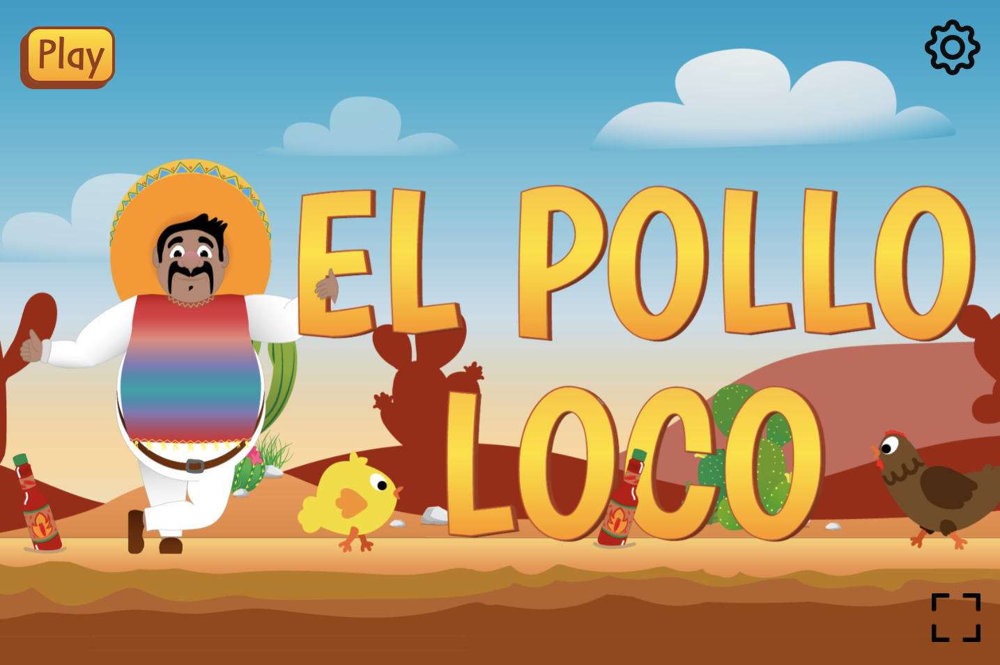
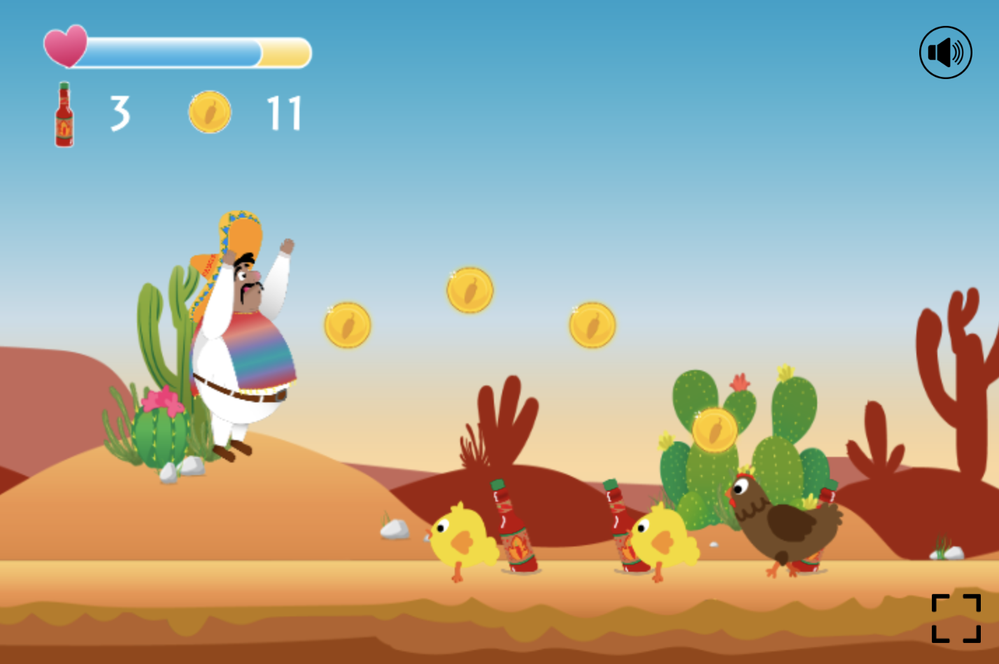

# El Pollo Loco 🌵

Welcome to my very first Jump 'n' Run Game! This is a classic side-scrolling platformer built with JavaScript, HTML and CSS.
This game is a solo project that I built as part of my web developer training program at **Developer Akademie**.



## 🚀 Features
- Smooth 2D side-scrolling platformer gameplay
- Collectible items
- Enemys with dynamic movement
- Responsive controls (keyboard & touch support)
- Animated character sprites and background
- Sound effects and background music

## 🛠️ Technologies Used
- HTML5 Canvas for rendering
- JavaScript for game logic
- CSS for styling

## 📜 How to Play
- **Arrow Keys**: Move left and right
- **Spacebar**: Jump (on small enemies)
- **D Key**: Attack by throwing a bottle (if available)
- **Collect** salsa bottles and coins
- **Reach** the end of the level
- **Fight** the endboss to win!
  


## 📂 Installation & Local Setup
If you want to run the game locally:

1. Clone the repository:
   ```bash
   git clone https://github.com/ayxcodes/jump-n-run-game.git
   ```
2. Navigate to the project directory:
   ```bash
   cd jump-n-run-game
   ```
3. Open `index.html` in your browser.

## 🤝 Contributing
Feel free to fork this repository and submit pull requests with improvements or new features!

## 📄 License
This project is open-source and available under the MIT License.

---

## Enjoy the game! 🎮
